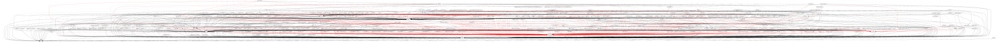

### Nom: Brian Mengibar Garcia

### Identificador: isx39441584

### Curs: HISX2

### Projecte: _Serveis informatius de Systemd_
------------------------------------------------------

# Eines per analitzar i gestionar Systemd
En l'altre document ja hem parlat sobre systemd i molts dels seus parametres,
si encara no ho habeu llegit, aqui teniu un enllaç per llegir-ho
abans de llegir aquest: [Systemd].

Hi ha moltes eines per poder gestionar i analitzar ``systemd``, en aquest
document explicaré totes les que he trobat, que paso a llistar-les per
despres explicar **exhaustivament** cadascuna:
* ``systemd-analyze``
* ``Systemadm``
* ``Systemd-kcm``
* ``Administrador de servicios`` --> de Yast????

## Systemd-analyze
Permet evaluar el proces d'arrencada amb el fi de mostrar quines unitats
estan ocasionan una demora en el procés en el procés d'arrencada. Aquestes
unitats, fan referencia fundamentalment a:
* serveis (.service)
* punts de montatje (.mount)
* dispositius (.device)
* sockets (.socket)

Una vegada obtinguda tota aquesta informació, es podria optimitzar el sistema
per minimitzar els temps d'arrencada.

### Parametres de Systemd-analyze
A continuació comentaré tots els parametres que te aquesta ordre:

*  systemd-analyze

Que ens mostra una sortida com aquesta
```
systemd-analyze 
       Startup finished in 765ms (kernel) + 1.654s (initrd) + 15.590s (userspace) = 18.010s
```

Aquesta informació general que ens mostra aquesta ordre, es **el temps total
de l'ultima arrencada del sistema**, especificant:
* El temps empleat en carregar el ``kernel``
* La carrega de ``initrd``
* El temps en l'espai de **l'usuari**

Al ser distribució __Fedora__, apareix ``intird``, en cambi en altres distribucions
com **Debian/Ubuntu**, no apareixen i la seva assignació de temps es carrega
en el kernel.

* ``systemd-analyze blame``

Aquest parametre, ens mostra **detalladament**, el temps empleat en carregar
cadascuna de les unitats, per que no quedi molt extens, filtrarem el resultat
d'exexutar aquesta ordre amb un ``head`` per que nomes ens sorti les 10 
primeres lineas. Llavors, en aquest cas que hem posat `head`, ens sortiren
les **10 unitats** que trigan mes en carregar-se.

```
systemd-analyze blame | head
         14.514s plymouth-quit-wait.service
         12.120s mariadb.service
         12.060s postgresql.service
         11.110s accounts-daemon.service
          1.055s plymouth-start.service
           750ms httpd.service
           692ms postfix.service
           578ms lvm2-pvscan@9:0.service
           570ms libvirtd.service
           434ms lvm2-monitor.service
```

* ``systemd-analyze critical-chain``

Aquest parametre es molt util, ja que ens mostra l'informació mes gràfica
a mode d'arbre amb la cadena d'unitats que tenen els majors temps de
carrega a l'hora d'arrencar el sistema

```
systemd-analyze critical-chain 
The time after the unit is active or started is printed after the "@" character.
The time the unit takes to start is printed after the "+" character.

graphical.target @15.576s
└─multi-user.target @15.576s
  └─mariadb.service @936ms +12.120s
    └─network.target @935ms
      └─wpa_supplicant.service @14.619s +12ms
        └─dbus.service @756ms
          └─basic.target @744ms
            └─sockets.target @744ms
              └─iscsiuio.socket @744ms
                └─sysinit.target @736ms
                  └─systemd-update-utmp.service @730ms +5ms
                    └─auditd.service @715ms +14ms
                      └─systemd-tmpfiles-setup.service @692ms +21ms
                        └─fedora-import-state.service @674ms +17ms
                          └─local-fs.target @671ms
                            └─run-user-42.mount @12.137s
                              └─local-fs-pre.target @670ms
                                └─lvm2-monitor.service @236ms +434ms
                                  └─lvm2-lvmetad.service @275ms
                                    └─lvm2-lvmetad.socket @235ms
                                      └─-.mount
                                        └─system.slice
                                          └─-.slice
```

Podem observar que abans de la grafica ens surten **dos missatges**:
* **The time after the unit is active or started is printed after the "@" character**. Aquesta frase esta mal redactada, llavors no podem saber si es refereix quan esta actiu? O estarted.
* **The time the unit takes to start is printed after the "+" character**. Vol dir que el caracter ``+`` es el temps que tarda en carregar el servei durant l'arrencada.

En el cas de no especificar l'opció **UNIT**, el target que es mostra es el 
que té el sistema per defecte, es a dir, nosaltres podem visualitzar la grafica
del target que nosaltres volguem, com per exemple el target ``emergency.target``

```
systemd-analyze critical-chain emergency.target
The time after the unit is active or started is printed after the "@" character.
The time the unit takes to start is printed after the "+" character.

└─fedora-import-state.service @746ms +17ms
  └─local-fs.target @734ms
    └─run-user-42.mount @12.387s
      └─local-fs-pre.target @734ms
        └─lvm2-monitor.service @240ms +492ms
          └─lvm2-lvmetad.service @289ms
            └─lvm2-lvmetad.socket @230ms
              └─-.slice
```

#### Targets en systemd
Estem veient que gracies a ``systemd-analyze critical-chain [UNIT]`` podem
veure les grafiques dels diferents targets del nostre sistema, pero clar,
quins son tots els _Targets Units_ que tenim en el sistema?
A continuació, mostro una taula que contindrà:
* runlevel
* Targets Units
* Descripció

| Runlevel  | Target Units                            | Descripció                                                                   |
|-----------|:---------------------------------------:|-----------------------------------------------------------------------------:|
| 0         | runlevel0.target, ``poweroff.target``   | Apaga el sistema                                                             |
| 1         | runlevel1.target, ``rescue.target``     | Mode mono-usuari                                                             |
| 2         | runlevel2.target, ``multi-user.target`` | Mode inici definit per l'usuari/sistema, per defecte identic a mode 3        |
| 3         | runlevel3.target, ``multi-user.target`` | Multiusuari, entorn grafic                                                   |
| 4         | runlevel4.target, ``multi-user.target`` | Mode inici definit per l'usuari/sistema, per defecte identic a mode 3        |
| 5         | runlevel5.target, ``graphical.target``  | Mutiusuari, entorn grafic, tots els serveis del mode 3 mes un entorn grafic  |
| 6         | runlevel6.target, ``reboot.target``     | Reiniciar                                                                    |
| emergency | ``emergency.target``                    | Shell d'emergencia                                                           |

* ``systemd-analyze plot``
Crea un archiu amb format ``.svg`` que descriu el procés d'arrancada de 
forma gráfica. 

```
[isx39441584@i10 projecte-final]$ systemd-analyze plot > grafica.svg && echo "Si surt aquest missatge? Significa que a anat be"
Si surt aquest missatge? Significa que a anat be
[isx39441584@i10 projecte-final]$ ll | grep grafica.svg
-rw-r--r--. 1 isx39441584 hisx2 116182 Apr 26 12:36 grafica.svg
```


* ``systemd-analyze time``
Aquest parametre ens dona el mateix resultat que si executem ``systemd-analyze``,
que tal i com hem dit a dalt es **el temps total de l'ultima arrencada del sistema**, 
especificant:
* El temps empleat en carregar el ``kernel``
* La carrega de ``initrd``
* El temps en l'espai de **l'usuari**

* ``systemd-analyze dot``
També crea un archiu amb format ``.svg`` que mostra un grafic de l'us
del sistema pero cal dir, que es una mica "lio". Lo primer que cal fer
es instal·lar el paquet **graphviz**. Una vegada instal·lat, ja podem 
executar l'ordre, que com podem veure, el resultat s'emmagatzemara en un
archiu ``.svg`` que en aquest cas s'anomenarà **systemd.svg**.

```
systemd-analyze dot --require | dot -Tsvg > systemd.svg
   Color legend: black     = Requires
                 dark blue = Requisite
                 dark grey = Wants
                 red       = Conflicts
                 green     = After
```



* ``systemd-analyze dump``
Aquest parametre dóna sortida __(en general molt llarg)__ a una serialització
llegible de l'estat del servidor complet. El seu format està subjecta a 
canvis sense **previ avís** i no ha de ser analitzat per les aplicacions.

Obviament la sortida es molt mes llarga, pero amb un fragment crec que
es suficient.

```
systemd-analyze dump 
-> Unit multi-user.target:
        Description: Multi-User System
        Instance: n/a
        Unit Load State: loaded
        Unit Active State: active
        State Change Timestamp: Thu 2017-04-27 08:12:54 CEST
        Inactive Exit Timestamp: Thu 2017-04-27 08:12:54 CEST
        Active Enter Timestamp: Thu 2017-04-27 08:12:54 CEST
        Active Exit Timestamp: n/a
        Inactive Enter Timestamp: n/a
        GC Check Good: yes
        Need Daemon Reload: no
        Transient: no
        Slice: n/a
        CGroup: n/a
        CGroup realized: no
        CGroup mask: 0x0
        CGroup members mask: 0x0
        Name: runlevel3.target
        Name: runlevel2.target
        Name: multi-user.target
        Name: runlevel4.target
```

 ``systemd-analyze set-log-level``
Cambia el nivell de registre actual del daemon de systemd al nivell que
nosaltres volguem, que per defecte tenim el nivell **info**. Els nivells
son:

* **alert**
* **crit**
* **debug**
* **emerg**
* **err**
* **info**
* **notice**
* **warning**

``systemd-analyze set-log-target``
Cambia el target del registre actual del daemon de systemd al target que
nosaltres volguem, que per defecte en aquest moment tenim el target
**graphical.target**. Els targets com els hem anomenat abans son:

* **poweroff.target**
* **rescue.target**
* **multi-user.target**
* **graphical.target**
* **reboot.target**

``systemd-analyze verify``
Una eina molt util que ens carrega files _"unit"_ (.socket, .mount, .device...),
si en algun _"unit"_ es detecten errors es printaran per pantalla, en el cas contrari
automaticament no sortira res per pantalla.

**Verifiquem http.service**:

```
systemd-analyze verify /usr/lib/systemd/system/httpd.service && echo "Si surt aquest missatge? Tot be"
Si surt aquest missatge? Tot be
```

**Verifiquem sftp.mount**:

```
systemd-analyze verify /usr/share/gvfs/mounts/sftp.mount
[/usr/share/gvfs/mounts/sftp.mount:3] Unknown lvalue 'Exec' in section 'Mount'
[/usr/share/gvfs/mounts/sftp.mount:4] Unknown lvalue 'AutoMount' in section 'Mount'
[/usr/share/gvfs/mounts/sftp.mount:5] Unknown lvalue 'Scheme' in section 'Mount'
[/usr/share/gvfs/mounts/sftp.mount:6] Unknown lvalue 'SchemeAliases' in section 'Mount'
[/usr/share/gvfs/mounts/sftp.mount:7] Unknown lvalue 'DefaultPort' in section 'Mount'
[/usr/share/gvfs/mounts/sftp.mount:8] Unknown lvalue 'HostnameIsInetAddress' in section 'Mount'
sftp.mount: What= setting is missing. Refusing.
sftp.mount: Failed to create sftp.mount/start: Unit sftp.mount is not loaded properly: Bad message.
```

Comprovem que aquest _"unit"_ te linies erroneas i a l'hora de verificar ens donen
els **missatges d'error**.


[Systemd]:https://github.com/brianmengibar/projecte-final/blob/master/notes_systemd.md#que-%C3%A9s-systemd

