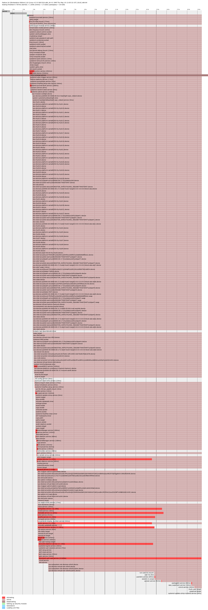

### Nom: Brian Mengibar Garcia

### Identificador: isx39441584

### Curs: HISX2

### Projecte: _Serveis informatius de Systemd_
------------------------------------------------------

# MIRAR TODO LO QUE HACE PLOT, PROBARLO CON OTROS TARGETS
# PROFUNDIZAR DOT, VER SU MAN, VER FORM_PATTERN TO PATTERN
# PONER VARIOS EJEMPLOS DE GRAFICAS I ENTONCES METERLAS EN UN ANNEXO
O TODAS JUNTAS, ESO POR CONFIRMAR PERO HAY QUE EXPLORAR INTENSAMENTE DOT

# Ordres visuals
Dins del sistema podem trobar diferents tipus d'ordres visuals, podem
trobar ordres que ens retornen una imatge, ordres que ens retornen una
grafica etc. Aquestes son les que jo he trobat i crec que les millors
que tenim en el sistema:

## Systemd-analyze plot
Crea un archiu amb format ``.svg`` que descriu el procés d'arrancada de 
forma gráfica. 

```
[isx39441584@i10 projecte-final]$ systemd-analyze plot > grafica.svg && echo "Si surt aquest missatge? Significa que a anat be"
Si surt aquest missatge? Significa que a anat be
[isx39441584@i10 projecte-final]$ ll | grep grafica.svg
-rw-r--r--. 1 isx39441584 hisx2 116182 Apr 26 12:36 grafica.svg
```



Aquesta grafica es de ``graphical.target``, ja que es en el target que
estic per defecte, llavors lo que acabo de fer es reiniciar la maquina
i entrar en **mode 1** --> ``rescue.target`` i aquesta es la grafica
que com podem comprobar, es molt diferent.


Per ultim, des de **mode 1** he fet un ``systemctl isolate emergency.target``
per anar a parar a **mode emergency** i aquesta es la grafica d'aquest
target.


### Significat colors
Com podem comprobar en aquesta grafica, a sota podem veure diferents colors tenim diferents colors que
i al costat un nom, que cadascun vol dir:
* ``Activating`` Mostra el temps exacte que tarda a activar-se els units mentres esta en procés l'arrencada.
* ``Active`` Ens diu en que moment exacte s'activen els units.
* ``Deactivating`` El temps que tarda en ser desactivar-se un unit per el motiu que sigui (ja sigui per un error, un problema, etc).
* ``Setting up security module`` El temps que tarda Systemd en configurar el modul de seguretat.
* ``Loading Unit Files`` El temps que tarda Systemd en carregar els archius dels units.

## Systemd-analyze dot
També crea un archiu amb format ``.svg`` que mostra un grafic de l'us
del sistema pero cal dir, que es una mica "lio". Lo primer que cal fer
es instal·lar el paquet **graphviz**. Una vegada instal·lat, ja podem 
executar l'ordre, que com podem veure, el resultat s'emmagatzemara en un
archiu ``.svg`` que en aquest cas s'anomenarà **systemd.svg**.

```
systemd-analyze dot --require | dot -Tsvg > systemd.svg
   Color legend: black     = Requires
                 dark blue = Requisite
                 dark grey = Wants
                 red       = Conflicts
                 green     = After
```


Amb aquesta ordre hem extret una imatge de l'us de **tot** el sistema,
pero també podem crear el grafic a partir d'un punt especific, per exemple
podem dir que comenci el grafic a partir de httpd.service.

> He agafat httpd per que la grafica es molt mes petita, ja que en
la imatge d'abans de tot el sistema no es veu practicament **res**.

```
systemd-analyze dot 'httpd.service' --require | dot -Tsvg > httpd.svg
   Color legend: black     = Requires
                 dark blue = Requisite
                 dark grey = Wants
                 red       = Conflicts
                 green     = After
```


### Parametres de systemd-analyze dot
Hi ha moments que no volem veure tot el sistema, o no volem a partir d'un
unit especific com hem fet a dalt con ``httpd.service``, per aixó he
trobat aquests dos parametres que crec que son molt utils:

* ``--from-pattern`` Amb aquest parametre podem especificar un unit
i veure qui depen d'aquest unit especific. Com per exemple, veure l'us
del sistema pero del target ``rescue.target``.
```
[isx39441584@i10 grafiques]$ systemd-analyze dot --from-pattern='rescue.target' | dot -Tsvg > from-rescue.svg
   Color legend: black     = Requires
                 dark blue = Requisite
                 dark grey = Wants
                 red       = Conflicts
                 green     = After
```


# FALTA METER EL --TO-PATTERN, EXPLICAR COLORES, METER MAS IMAGENES

> Les imatges son en format ``.png`` per que he vist que **Github** no
soporta el format ``.svg``, llavors des d'aquesta [pagina] he cambiat
el format de ``.svg`` a ``.png``.

[pagina]: http://svgtopng.com/es/
