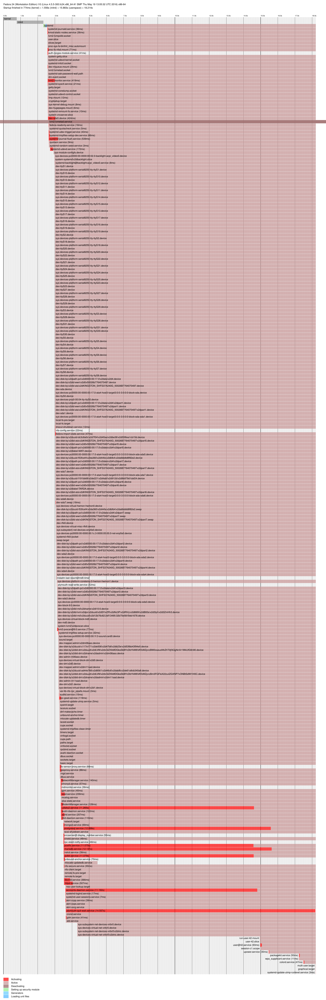
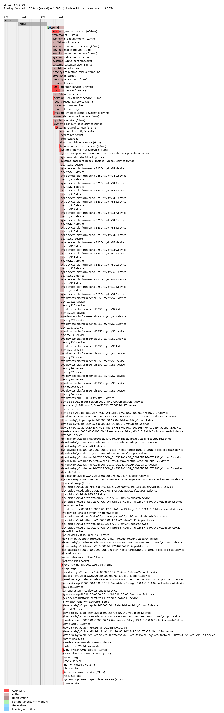
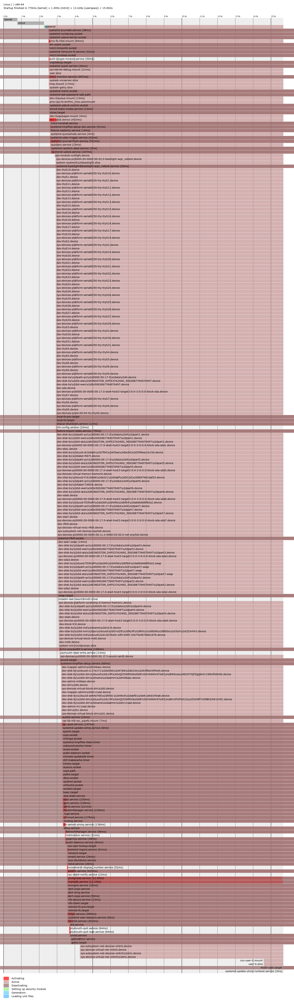
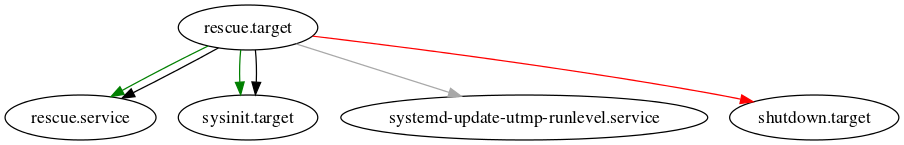
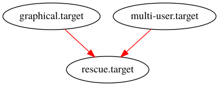

### Nom: Brian Mengibar Garcia

### Identificador: isx39441584

### Curs: HISX2

### Projecte: _Serveis informatius de Systemd_
------------------------------------------------------

# MIRAR TODO LO QUE HACE PLOT, PROBARLO CON OTROS TARGETS
# PROFUNDIZAR DOT, VER SU MAN, VER FORM_PATTERN TO PATTERN
# PONER VARIOS EJEMPLOS DE GRAFICAS I ENTONCES METERLAS EN UN ANNEXO
O TODAS JUNTAS, ESO POR CONFIRMAR PERO HAY QUE EXPLORAR INTENSAMENTE DOT

# Ordres visuals

Dins del sistema podem trobar diferents tipus d'ordres visuals, podem
trobar ordres que ens retornen una imatge, ordres que ens retornen una
grafica etc. Aquestes son les que jo he trobat i crec que les millors
que tenim en el sistema:

## Systemd-analyze plot

Crea un archiu amb format `.svg` que descriu el procés d'arrancada de 
forma gráfica. 

```
$ systemd-analyze plot > grafica-plot-target-actual.svg; inkscape -e grafica-plot-target-actual.png grafica-plot-target-actual.svg
Background RRGGBBAA: ffffff00
Area 0:0:1901:5830 exported to 1901 x 5830 pixels (90 dpi)
Bitmap saved as: grafica-plot-target-actual.png
```



Com podem observar, en la linia d'ordre trobem l'eina `ìnkscape`, es necessaria
per convertir de format `.svg` a `.png` ja que al pujar les imatges, m'he
donat compte de que **github** no soporta l'extensió `.svg`. Així que
tenia que buscar alguna manera per poder **transformar** de format i la 
veritat que amb `inkscape` es molt fàcil i eficaç, només cal executar
`dnf -y install inkscape`, en el moment que ho tenim instal·lat amb el 
parametre `-e` per especificar amb quin format ho volem exportar i al 
final de la linia posant la imatge? Ja fa la conversió automaticament.

Aquesta grafica es de `graphical.target`, ja que es en el target que
estic per defecte, llavors lo que acabo de fer es reiniciar la maquina
i entrar en **mode 1** --> `rescue.target` i aquesta es la grafica
que com podem comprobar, es molt diferent.



Per ultim, des de **mode 1** he fet un `systemctl isolate emergency.target`
per anar a parar a **mode emergency** i aquesta es la grafica d'aquest
target.



### Significat colors

Com podem comprobar en aquesta grafica, a sota podem veure diferents colors tenim diferents colors que
i al costat un nom, que cadascun vol dir:

* `Activating`

	Mostra el temps exacte que tarda a activar-se els units mentres esta en procés l'arrencada.

* `Active` 

	Ens diu en que moment exacte s'activen els units.

* `Deactivating`

	El temps que tarda en ser desactivar-se un unit per el motiu que sigui (ja sigui per un error, un problema, etc).

* `Setting up security module`

	El temps que tarda Systemd en configurar el modul de seguretat.

* `Loading Unit Files`

	El temps que tarda Systemd en carregar els archius dels units.

## Systemd-analyze dot

També crea un archiu amb format `.svg` que mostra un grafic de l'us
del sistema pero cal dir, que es una mica "lio". Lo primer que cal fer
es instal·lar el paquet **graphviz**. Una vegada instal·lat, ja podem 
executar l'ordre, que com podem veure, el resultat s'emmagatzemara en un
archiu `.svg`.

```
$ systemd-analyze dot --require | dot -Tsvg > grafica-dot-target-actual.svg; inkscape -e grafica-dot-target-actual.png grafica-dot-target-actual.svg
   Color legend: black     = Requires
                 dark blue = Requisite
                 dark grey = Wants
                 red       = Conflicts
                 green     = After
Background RRGGBBAA: ffffff00
Area 0:0:32236.2:1225 exported to 32236 x 1225 pixels (90 dpi)
Bitmap saved as: grafica-dot-target-actual.png
```


Amb aquesta ordre hem extret una imatge de l'us de **tot** el sistema,
pero també podem crear el grafic a partir d'un punt especific, per exemple
podem dir que comenci el grafic a partir de httpd.service.

He agafat httpd per que la grafica es molt mes petita, ja que en
la imatge d'abans de tot el sistema no es veu practicament **res**.

```
$ systemd-analyze dot 'httpd.service' --require | dot -Tsvg > httpd.svg; inkscape -e httpd.png httpd.svg   Color legend: black     = Requires
                 dark blue = Requisite
                 dark grey = Wants
                 red       = Conflicts
                 green     = After
Background RRGGBBAA: ffffff00
Area 0:0:767.5:235 exported to 768 x 235 pixels (90 dpi)
Bitmap saved as: httpd.png
```


### Parametres de systemd-analyze dot

Hi ha moments que no volem veure tot el sistema, o no volem a partir d'un
unit especific com hem fet a dalt con `httpd.service`, per aixó he
trobat aquests dos parametres que crec que son molt utils:

* `--from-pattern` 

	Amb aquest parametre podem especificar un unit
	i veure qui depen d'aquest unit especific. Com per exemple del target
	`rescue.target`.

	```
	$ systemd-analyze dot --from-pattern='rescue.target' | dot -Tsvg > from-rescue.svg; inkscape -e from-rescue.png from-rescue.svg
	   Color legend: black     = Requires
					 dark blue = Requisite
					 dark grey = Wants
					 red       = Conflicts
					 green     = After
	Background RRGGBBAA: ffffff00
	Area 0:0:902.5:145 exported to 903 x 145 pixels (90 dpi)
	Bitmap saved as: from-rescue.png
	```

	

	Que com podem observar:
	
  * Es **requerit**(per la fletcha negra) que després d'engegar `rescue.target`, estigui engegat `sysinit.target` i `rescue.service` (per la fletcha verda).
  * Vol que estigui engegat el servei `systemd-update-utmp-runlevel.service` (per la fletcha gris).
  * Si volguem engegar a `shutdown.target` ens diu que entrarà en conflicte(per la fletcha vermella), lo que vol dir es que no poden estar els dos engegats.

* `--to-pattern`
	
	Amb aquest parametre, igual que `--from-pattern` podem especificar
	un unit i veure aquest unit, que necessita per poder engegarse. Per
	seguir amb el mateix exemple, ho he tornat a fer amb `rescue.target`.
	
	```
	$ systemd-analyze dot --to-pattern='rescue.target' | dot -Tsvg > to-rescue.svg; inkscape -e to-rescue.png to-rescue.svg
   Color legend: black     = Requires
                 dark blue = Requisite
                 dark grey = Wants
                 red       = Conflicts
                 green     = After
	Background RRGGBBAA: ffffff00
	Area 0:0:760:145 exported to 760 x 145 pixels (90 dpi)
	Bitmap saved as: to-rescue.png
	```

	
	
	Que com podem observar
  * Te que estar engegat `systemd-update-utmp-runlevel.service` per despres engegar `rescue.target`
  * Si estem en `multi-user.target` o `graphical.target` entrarà en conflicte amb `rescue.target`, lo que vol dir que no poden estar els dos engegats
  
# FALTA METER EL EXPLICAR COLORES, METER MAS IMAGENES COMO ABRTD.SERVICE
# EXPLICAR DIFERENCIA ENTRE --FROM-PATTERN I --TO-PATTERN
