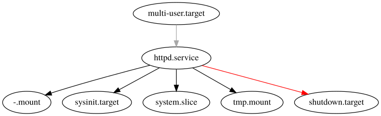
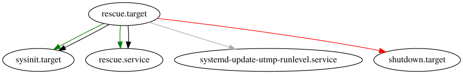

### Nom: Brian Mengibar Garcia

### Identificador: isx39441584

### Curs: HISX2

### Projecte: _Serveis informatius de Systemd_
------------------------------------------------------

<!--
# MIRAR TODO LO QUE HACE PLOT, PROBARLO CON OTROS TARGETS
# PROFUNDIZAR DOT, VER SU MAN, VER FORM_PATTERN TO PATTERN
# PONER VARIOS EJEMPLOS DE GRAFICAS I ENTONCES METERLAS EN UN ANNEXO
O TODAS JUNTAS, ESO POR CONFIRMAR PERO HAY QUE EXPLORAR INTENSAMENTE DOT
-->

# Ordres visuals

Dins del sistema podem trobar diferents tipus d'ordres visuals, podem
trobar ordres que ens retornen una imatge, ordres que ens retornen una
gràfica etc. Aquestes son les que jo he trobat i crec que les millors
que tenim en el sistema:

## Explorant plot

L'ordre `systemd-analyze plot` crea un arxiu amb format `.svg` que descriu el procés d'arrancada de 
forma gràfica 

```
$ systemd-analyze plot > grafica-plot-target-actual.svg

$ inkscape --export-png=grafica-plot-target-actual.png grafica-plot-target-actual.svg
Background RRGGBBAA: ffffff00
Area 0:0:1901:5830 exported to 1901 x 5830 pixels (90 dpi)
Bitmap saved as: grafica-plot-target-actual.png
```


Com podem observar, en la segona ordre trobem l'eina `ìnkscape`, es necessària
per convertir de format `.svg` a `.png` ja que al pujar les imatges, m'he
donat compte de que **github** no suporta l'extensió `.svg`. Així que
tenia que buscar alguna manera per poder **transformar** de format i la 
veritat que amb `inkscape` es molt fàcil i eficaç, només cal executar
`dnf -y install inkscape`, en el moment que ho tenim instal·lat amb el 
paràmetre `--export-png=` per especificar amb quin format ho volem exportar i al 
final de la línia posant la imatge? Ja fa la conversió automàticament peró
té un inconvenient, que lamentablement obre un pop-up que he explorat
com fer per que no sorti pero no hi ha cap ordre.

Aquesta gràfica es de `graphical.target`, ja que es en el target que
estic per defecte, llavors lo que acabo de fer es **reiniciar** la maquina
i entrar en __mode 1__ (\ `rescue.target`) i aquesta es la seva gràfica
que com podem comprovar, es molt diferent.


Per ultim, des de **mode 1** he fet un `systemctl isolate emergency.target`
per anar a parar a **mode emergency** i aquesta es la gràfica d'aquest
target.


### Significat colors

Com podem comprovar en aquesta gràfica, a sota podem veure diferents colors tenim diferents colors que
i al costat un nom, que cadascun vol dir:

* `Activating`

	Mostra el temps exacte que tarda a activar-se els units mentre esta en procés l'arrencada.

* `Active` 

	Ens diu en que moment exacte s'activen els units.

* `Deactivating`

	El temps que tarda en ser desactivar-se un unit per el motiu que sigui (ja sigui per un error, un problema, etc).

* `Setting up security module`

	El temps que tarda Systemd en configurar el modul de seguretat.

* `Loading Unit Files`

	El temps que tarda Systemd en carregar els arxius dels units.

### Diferencies entre les gràfiques emergency i rescue

El unit `emergency.target` proporciona l'entorn més mínim possible, es
a dir, el sistema munta el sistema de fitxers arrel només per a **lectura**,
no intenta muntar altres sistemes d'arxius locals, no activa les interfícies
de xarxa, i només inicia uns serveis **essencials**. Per aixó en la gràfica
podem observar que fa el pas de desactivar tots els serveis que veu que no
son essencials per l'arrencada del sistema. En cambi, en el unit `rescue.target`,
proporciona un entorn d'usuari únic convenient, el sistema intenta
muntar tots els sistemes de fitxers locals i iniciar alguns serveis
del sistema **importants**, però no activa les interfícies de xarxa.

## Explorant dot

L'ordre `systemd-analyze dot` també crea un arxiu amb format `.svg` 
que mostra un gràfic de l'us del sistema. Lo primer que cal fer es 
instal·lar el paquet **graphviz**. Una vegada instal·lat, ja podem 
executar l'ordre, que com podem veure, el resultat s'emmagatzemara en un
arxiu `.svg`.

```
$ systemd-analyze dot --require \
  | dot -Tsvg > grafica-dot-target-actual.svg
   Color legend: black     = Requires
                 dark blue = Requisite
                 dark grey = Wants
                 red       = Conflicts
                 green     = After

$ inkscape --export-png=grafica-dot-target-actual.png grafica-dot-target-actual.svg
Background RRGGBBAA: ffffff00
Area 0:0:32236.2:1225 exported to 32236 x 1225 pixels (90 dpi)
Bitmap saved as: grafica-dot-target-actual.png
```

Amb aquesta ordre hem extret una imatge de l'us de **tot** el sistema,
però també podem crear el gràfic a partir d'un punt especific, per exemple
podem dir que comenci el gràfic a partir de httpd.service.

He agafat httpd per que la gràfica es molt mes petita, ja que en
la imatge d'abans de tot el sistema no la he posat per el motiu de que
no es veu pràcticament **res**.

```
$ systemd-analyze dot 'httpd.service' --require \
  | dot -Tsvg > httpd.svg
         Color legend: black     = Requires
                 dark blue = Requisite
                 dark grey = Wants
                 red       = Conflicts
                 green     = After

$ inkscape --export-png=httpd.png httpd.svg
Background RRGGBBAA: ffffff00
Area 0:0:767.5:235 exported to 768 x 235 pixels (90 dpi)
Bitmap saved as: httpd.png
```



### Significat dels colors

En el moment que executem aquesta ordre, a sota ens apareix sempre
això:

```
Color legend: black     = Requires
        dark blue = Requisite
        dark grey = Wants
        red       = Conflicts
        green     = After
```

Aquests colors són els que es reflecteixen en les **fletxes de les
gràfiques** que òbviament, cadascuna te un significat:

* black

	On apunti una fletxa de color negra vol dir que es requerit que aquell unit estigui activat.

* dark blue

	On apunti una fletxa de color blau fosc vol dir que es un requisit que aquell unit estigui activat.

* dark grey

	On apunti una fletxa de color gris vol dir que aquell unit que estem mirant? Vol que estigui activat un unit especific

* red

	On apunti una fletxa de color vermell vol dir que no poden estar el unit que estem mirant i el que apunta la fletxa activats, ja que entre ells podrueixen conflicte.

* green
	On apunti una fletxa de color verd vol dir que després s'engegara el unit especific o que en el moment que aquest unit específic estigui activat, després ha d'activar el unit que apunta la fletxa.

### Parametres de systemd-analyze dot

Hi ha moments que no volem veure tot el sistema, o no volem a partir d'un
unit especific com hem fet a dalt con `httpd.service`, per això he
trobat aquests dos paràmetres que crec que son molt útils:

* `--from-pattern` 

	Amb aquest paràmetre podem especificar un unit
	i veure qui depèn d'aquest unit especific Com per exemple del target
	`rescue.target`.

	```
	$ systemd-analyze dot --from-pattern='rescue.target' \
	  | dot -Tsvg > from-rescue.svg
	   Color legend: black     = Requires
					 dark blue = Requisite
					 dark grey = Wants
					 red       = Conflicts
					 green     = After

	$ inkscape --export-png=from-rescue.png from-rescue.svg
	Background RRGGBBAA: ffffff00
	Area 0:0:902.5:145 exported to 903 x 145 pixels (90 dpi)
	Bitmap saved as: from-rescue.png
	```

	

	Que com podem observar:
	
  * Es **requerit**(per la fletxa negra) que després d'engegar `rescue.target`, estigui activat `sysinit.target` i `rescue.service` (per la fletxa verda).
  * Vol que estigui activat el servei `systemd-update-utmp-runlevel.service` (per la fletxa gris).
  * Si volem engegar a `shutdown.target` ens diu que entrarà en conflicte(per la fletxa vermella), lo que vol dir es que no poden estar els dos activats.

* `--to-pattern`
	
	Amb aquest paràmetre, igual que `--from-pattern` podem especificar
	un unit i veure aquest unit, que necessita per poder engegar-se Per
	seguir amb el mateix exemple, ho he tornat a fer amb `rescue.target`.
	
	```
	$ systemd-analyze dot --to-pattern='rescue.target' \
	| dot -Tsvg > to-rescue.svg
   Color legend: black     = Requires
                 dark blue = Requisite
                 dark grey = Wants
                 red       = Conflicts
                 green     = After
    
    $ inkscape --export-png=to-rescue.png to-rescue.svg
	Background RRGGBBAA: ffffff00
	Area 0:0:760:145 exported to 760 x 145 pixels (90 dpi)
	Bitmap saved as: to-rescue.png
	```

	
	
	Que com podem observar
  * Te que estar activat `systemd-update-utmp-runlevel.service` per després engegar `rescue.target`
  * Si estem en `multi-user.target` o `graphical.target` entrarà en conflicte amb `rescue.target`, lo que vol dir que no poden estar els dos activats


<!--
# FALTA METER EL EXPLICAR COLORES, METER MAS IMAGENES COMO ABRTD.SERVICE
# EXPLICAR DIFERENCIA ENTRE --FROM-PATTERN I --TO-PATTERN
-->
