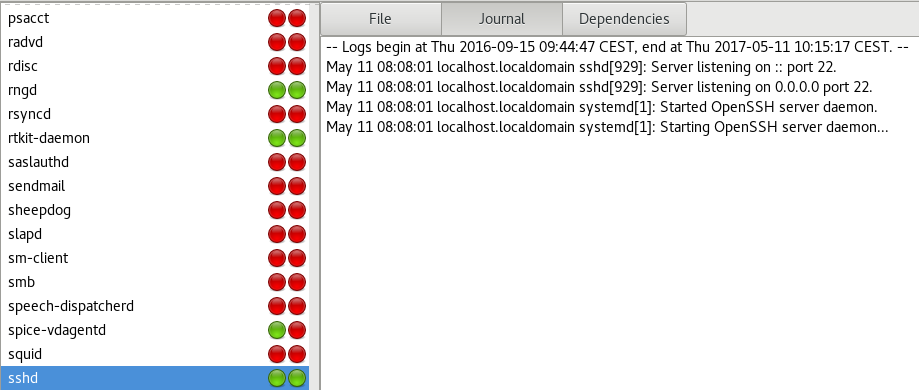
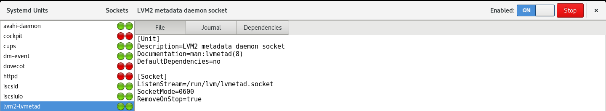

### Nom: Brian Mengibar Garcia

### Identificador: isx39441584

### Curs: HISX2

### Projecte: _Serveis informatius de Systemd_
------------------------------------------------------

# Reports Dinamics

En aquest apartat comentaré les eines que he trobat per veure reports
dinamics, la veritat es que no sabia l'existencia d'aquestes ordres,
pot ser no tenen molt que veure pero es lo mes assemblant que he trobat.
Aquestes son les dues que he trobat:

* Cockpit
* Systemd-manager

## Que és cockpit?

És un **administrador de servidor** que fa que sigui fàcil d'administrar
els nostres servidors **GNU/Linux** a través d'un _navegador web_.

### Característiques de cockpit

La veritat es que `cockpit` ho veig molt util per els que comencen sent 
administradors de sistemes, ja que permet realitzar fàcilment tasques 
senzilles, com:

* Administració d'emmagatzematge
* Inspecció
* Iniciar i  aturar serveis.

També m'he donat compte de que te una molt bona utilitat i es que dins
de la pagina web podem tenir una terminal, cosa que va molt be, ja que si
surgeix algun problema i ho vols veure graficament ja ho tens tot en una
mateixa pagina. I per ultim, tambe he vist que pot ser __multi-server__,
es a dir, que podem supervisar i administrar diversos servidors al mateix
temps.

Pero jo només em centraré en els serveis i veure totes les utilitats que
tenen relació amb aquest tema.

### Com funciona cockpit

Lo primer de tot sera instal·lar el paquet anomenat `cockpit`.

```# dnf -y install cockpit```

Com podem observar, es un servei, aixi que caldrà iniciar aquest **servei**.

```
# systemctl start cockpit

# systemctl status cockpit
● cockpit.service - Cockpit Web Service
   Loaded: loaded (/usr/lib/systemd/system/cockpit.service; static; vendor preset: disabled)
   Active: active (running) since Fri 2017-04-28 09:36:22 CEST; 19s ago
     Docs: man:cockpit-ws(8)
  Process: 3604 ExecStartPre=/usr/sbin/remotectl certificate --ensure --user=root --group=cockpit-ws --selinux-type=etc_t (code=exited, status=0/SUCCESS)
 Main PID: 3615 (cockpit-ws)
    Tasks: 2 (limit: 512)
   CGroup: /system.slice/cockpit.service
           └─3615 /usr/libexec/cockpit-ws

Apr 28 09:36:22 i10 systemd[1]: Starting Cockpit Web Service...
Apr 28 09:36:22 i10 remotectl[3604]: Generating temporary certificate using: openssl req -x509 -days 36500 -newkey rsa:2048 -keyout /etc/cockpit/ws-certs.d/0-
Apr 28 09:36:22 i10 systemd[1]: Started Cockpit Web Service.
Apr 28 09:36:22 i10 cockpit-ws[3615]: Using certificate: /etc/cockpit/ws-certs.d/0-self-signed.cert
```

Una vegada hem vist que el servei està arrancat, cal accedir mediant el
**navegador Firefox**, com? Afegint la teva IP i redirigint al port 9090
que per defecte es el que escolta el servei `cockpit`.


**https://192.168.2.40:9090/**


Al accedir ens demanarà un usuari i un password, en el meu cas amb 
**root**.

### Funcionament de cockpit

En el moment que accedim, la primera pagina ens mostra els detalls del
nostre ordinador i grafics que mostren:

* CPU
* Us de memoria
* Disc I/O
* Trafic de xarxa


A l'esquerra tenim una serie de finestres que paso a continuació a explicar:

* **System**

	Es la pagina principal, lo que es mostra res mes accedir a la pagina
	
* **Services**

	Aquesta es la part que profundiré, al fer clic a qualsevol servei, ens porta a una pàgina de detallada que mostra un registre del servei i que ens permet:
  * Start/Stop
  * Restart
  * Enable/Disable
  * Reload
  
* **Containers**

	Permet gestionar els nostres _"contenidors"_ de Docker, podem:
  * Cercar nous contenidors
  * Afegir o eliminar els recipients
  * Iniciar i aturar ells
  
* **Logs** 

	Conté tots els logs del sistema, es a dir, de tots els serveis, ens permet fer clic a qualsevol entrada per obtenir informació més detallada, com la identificació de procés.

* **Storage**

	Dóna un aspecte gràfic en el disc que llegeix i escriu, també ens permet veure els registres pertinents. A més, es pot configurar i administrar els dispositius RAID i grups de volums, donar format, partició, i muntar/desmuntar unitats.
	
* **Networking**

	Ens mostra una visió general de trànsit entrant i sortint, juntament amb els registres pertinents i informació d'interfície de xarxa.
	
* **Tools**

	Aquest menu es desplega per oferir dues eines de gestió de servidors i usuaris adicionals:
  * **Accounts**: Permet afegir i administrar usuaris, configurar i canviar les contrasenyes, afegir i administrar les claus SSH públiques per a cada usuari (**Obviament sempre que siguis root**).
  * **Terminal**: Conté un terminal completament funcional, amb l'implementació del tabulador, aixo ens permet realitzar qualsevol tasca que volguem.

  

Una vegada explicat la primera part, paso a explicar la segona finestra que tenim
anomenada __Dashboard__. En aquesta finestra lo que trobem es una grafica
amb **4 finestretes**, que es per veure els mateixos grafics que ens surten
en la pagina principal.


Bé, com he comentat a dalt, `cockpit` es un __multi-server__, llavors en aquest
apartat podem fer:

* Afegir una nova maquina
* Editar una maquina actual
* Esborrar una maquina actual

#### Afegir una nova maquina

Per afegir una nova maquina veiem el simbol **+** de color blau que
significa `Add Server`. En el moment que cliquem ens demana la **IP** o
el **hostname** de la maquina que volem afegir i amb quin color volem
visualitzar-la (molt util per que si posem el mateix nom en dues maquines
i amb el mateix color? Tindriem un gran problema). 


En el moment que posem la IP i le donem a `Add` ens diu 
**Unknown Host Key** ens esta dient que l'autenticitat de la IP no pot 
ser establerta, que si estem segurs de continuar amb la connexió.


Obviament li donem a `connect` i ja tenim una maquina més i al 
ser **root**, podrem modificar/visualitzar, etc.


#### Editar una maquina actual

Per editar una maquina actual veiem el simbol del `tick`, quan li donem
ens apareixen dos simbols:

 * **Un llapis que ens deixara modificar**
  * Host Name
  * Color
  * Avatar

   Per exemple, cambiar el nom i el color com veiem a continuació:

   
   
   Una vegada fet, li donem a `set` per desar els canvis.

 * **Una paperera**

	En el moment que cliquem no ens diu si estem segurs, si no que directament l'esborra.

	

Que passa? Que ara si volem tornar a afegir la maquina anterior ja no ens
dirà **Unknown Host Key**, ja que ja coneix aquest finger print i sap que
si que permetem la connexió amb aquella IP.

#### Apartat services

Com he dit abans a dalt, aquest apartat ens deixa poder veure tots els serveis
que tenim actius, desactivats, engegats, aturats, etc. Pero també tenim
mes apartats dins de services:

* Targets

	Ens motra tots els targets que tenim en el sistema, es a dir, els que tenim enabled, disabled i statics. Vaig probar cambiar d'un runlevel a un altre, clicant per exemple al target ``rescue.target`` i clicant a **start**, pero sempre que ho faig es queda el sistema penjat i tinc que reiniciar manualment.
	
* System services

	Aquesta es la part on podem iniciar i aturar serveis, es molt util aquesta part ja que tambe podem veure els que estan enabled, disabled i statics, també podem veure els logs que es crean automaticament, aixi sabriem si ens ha fallat alguna cosa o tot funciona be.
	
* Sockets

	Idem que els anteriors, ens mostren tots els sockets i podem iniciar o aturar el que nosaltres volguem
	
* Timer

	Aquest apartat conté tots els `.timer`, son temporizadors que li diuen al servei quan es te que executar.

* Paths

	Aquest apartat conté tots els `.path`, lo que fan es codificar l'informació sobre un camí monitoritzat per systemd.

  

##### System services

Aquesta eina un dels defectes que té es que no te una busqueda de filtratge,
si no que per buscar podem fer `ctrl+f` i buscar per exemple __httpd.service__.
Quan cliquem ens mostra una pagina detallada on podem engegar/aturar el servei
i tambe a sota veure els logs que ens dona actualment.


Com podem comprobar, ara mateix esta el servei engegat, ara cliquem
a **stop** i podem veure com l'apartat `Service Logs` s'actualitza
automaticament dient que s'aturat el servei


Gràcies a l'apartat `tools`, podem veure l'estat del nostre servei 
per comprobar que funciona correctament.


## Que és systemd-manager?

Systemd-manager es un programa construit amb llenguatge de programació
__RUST__, que s'integra a la perfecció en entorns d'escriptori **GTK**.

### Característiques de systemd-manager

Es molt semblant a l'eina `cockpit` pero aquesta son les seves característiques:

* Enable/disable als units (serveis, sockets...)
* Start/Stop als units (serveis, sockets...)
* Veure i modificar els arxius de configuració del unit
* Veure els logs que es crean al instant
* Comprovar el temps d'arrencada utilitzant l'eina `systemd-analyze` (comentada en l'altre [document](notes_eines_systemd.md#systemd-analyze))

### Instal·lació systemd-manager

Per poder utilitzar-lo en **Fedora**, necessitem descarregarnos un paquet,
ja que per defecte aquesta eina no la podem instalar al nostre sistema.

```
# dnf install systemd-manager
Last metadata expiration check: 1:12:22 ago on Wed May  3 09:21:18 2017.
No package systemd-manager available.
Error: Unable to find a match.
```

En el moment que ho probaba veia que em deia que no trobaba coincidencies,
llavors, explorant per webs he trobat com es pot instal·lar, cal descarregar-se
un paquet exclusiu per **Fedora 24** (també he trobat per la versió 22 i 23 pero
en el meu cas no cal).

```
# wget https://copr.fedorainfracloud.org/coprs/nunodias/systemd-manager/repo/fedora-24/nunodias-systemd-manager-fedora-24.repo -O /etc/yum.repos.d/nunodias-systemd-manager-fedora-24.repo
--2017-05-03 10:33:56--  https://copr.fedorainfracloud.org/coprs/nunodias/systemd-manager/repo/fedora-24/nunodias-systemd-manager-fedora-24.repo
Resolving copr.fedorainfracloud.org (copr.fedorainfracloud.org)... 209.132.184.54
Connecting to copr.fedorainfracloud.org (copr.fedorainfracloud.org)|209.132.184.54|:443... connected.
HTTP request sent, awaiting response... 200 OK
Length: 374 [text/plain]
Saving to: ‘/etc/yum.repos.d/nunodias-systemd-manager-fedora-24.repo’

/etc/yum.repos.d/nunodias-systemd-manag 100%[=============================================================================>]     374  --.-KB/s    in 0s      

2017-05-03 10:33:57 (50.3 MB/s) - ‘/etc/yum.repos.d/nunodias-systemd-manager-fedora-24.repo’ saved [374/374]
```

Amb aquesta ordre ja esta instal·lat el paquet que necessitem, una vegada
ho tenim cal instal·lar `systemd-manager`.

```
# dnf -y install systemd-manager
```

Una vegada instal·lada, des de terminal posem `systemd-manager` i ja 
estem dins de l'aplicació.


Cal dir que si no som root, també s'executa, pero en el moment que
volem per exemple aturar el servei **bluetooh**, clarament no ens deixa
i en la terminal ens surt aquest missatge: 
`systemd-manager: bluetooth.service failed to stop: 
"Interactive authentication required."` que basicament ens diu que
necessitem autenticació per poder aturar el servei.

### Funcionament systemd-manager

En el moment que executem aquesta aplicació, podem escollir amb dos opcions:

* Systemd Units
* Systemd Analyze

	

#### Systemd Units

En aquest apartat podem trobar:

* Services
* Sockets
* Timers

	

##### Services

Aquesta es la part on podem iniciar i aturar serveis, també podem veure 
els que estan enabled, disabled i statics, veure els logs que es crean 
automaticament, aixi sabriem si ens ha fallat alguna cosa o tot funciona
be i també poder editar el fitxer de configuració, que la veritat que ho
veig molt util. Trobem al costat del serveis dues rodones:

* La primera significa si esta **enabled(color verd)** o **disabled(color vermell)**
* La segona significa si esta **start(color verd)** o **disabled(color vermell)**

Al clicar sobre un servei, podem observar **tres apartats**:

* File

	Ens surt el fitxer de configuració, on podrem mirar-ho o editar-ho i en el cas de editar-ho guardar la nova configuració.

	

* Journal

	Ens mostra els logs del servei que nosaltres hem clicat, lo bo d'aquest log es que es com `journalctl -f` en el moment que aturem/engeguem fem enable/disable algun servei ens sortira al moment el missatge en aquest apartat.

	

* Dependencies

	Ens diu de quins serveis depèn el servei que nosaltres hem clicat per que s'engegui

	

Per ultim, tenim dos icones mes:

* Enabled/Disabled

	Nomes clicant en aquest icone podem fer el servei **enable** o **disable**

	Com podem veure, el servei `sshd` ara mateix esta **enable**, en el moment
	que cliquem automaticament es posa disable.
	
	

	I de nou ho posem **enable**:

	

* Start/Stop

	Si el servei esta engegat, ens sortira l'icona vermell i posarà **Stop**, si cliquem llavors l'icona pasara a ser de color blau i posara **Start**

	

	Com podem comprobar, ara mateix el servei esta engegat, aixi que ara ens
	posarem en l'apartat **journal** i aturarem el servei.

	

	Una vegada hem aturat el servei, veiem que l'apartat **journal** actualment 
	ens dona l'informació de que el servei `sshd` s'ha aturat i veiem que
	l'icona actualment a cambiat.

##### Sockets and Timers

Mateixes condicions que l'apartat **Services**.

* Sockets

	

* Timers

	

#### Systemd Analyze

Aquest apartat lo que fa simplement es comprovar el temps d'arrencada dels
serveis que tarden de **menys** a **mes** temps durant el procés d'arrencada.


